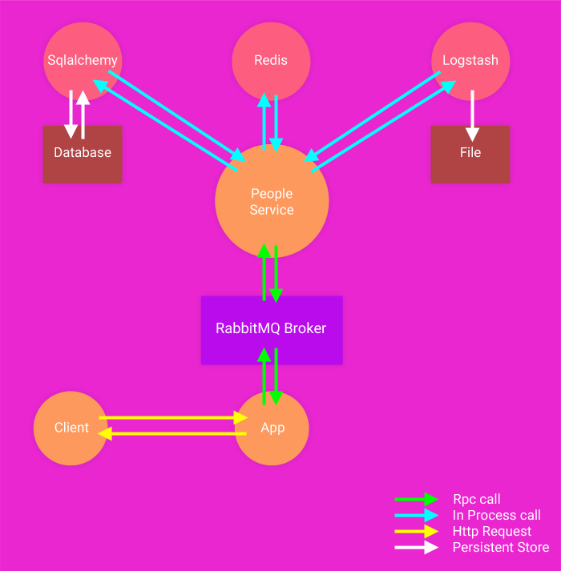

Nameko App With Extensions
==========================

We will going to create a simple app with `Nameko microservices <https://github.com/nameko/nameko>`_ and extensions.
Extensions include `nameko logstash <https://github.com/jdsolucoes/nameko-logstash>`_ for logging, `flask nameko <https://github.com/clef/flask-nameko>`_ for web framework and `nameko sqlalchemy <https://github.com/onefinestay/nameko-sqlalchemy>`_ for database interactions.

Installation
------------

Nameko
++++++

.. code-block:: bash
    
    pip install -U nameko

Flask
+++++

- Install ``nameko-flask``

.. code-block:: bash
    
    pip install -U flask_nameko

Logstash
++++++++

- Install ``nameko-logstash``

.. code-block:: bash
    
    pip install -U nameko-logstash

Sql Alchemy
+++++++++++

.. code-block:: bash

    pip install -U nameko-sqlalchemy

Redis
+++++

.. code-block:: bash

    pip install -U nameko-redis

Setup
-----

- Run the ``people`` service

.. code-block:: bash

    cd nameko-extension-app
    nameko run nameko_extension_app.services.people --config .\nameko_extension_app\configs\nameko.yml

- Run the app

.. code-block:: bash

    cd nameko-extension-app
    python3 nameko_extension_app/app.py

Working
-------

#. Client will send a http request to ``localhost:5000`` which reaches the ``app``.
#. App places this request onto RabbitMQ broker.
#. Broker routes this message to ``people`` service.
#. Service interacts with its dependencies to process the request.
#. Service calls ``sqlalchemy`` dependency to interact with lower level persistence database and sends the result back to ``people`` service.
#. Post this operation, service calls ``redis`` dependency to save the result as cache.
#. Finally, service logs the operation using ``logstash`` dependency.

|
